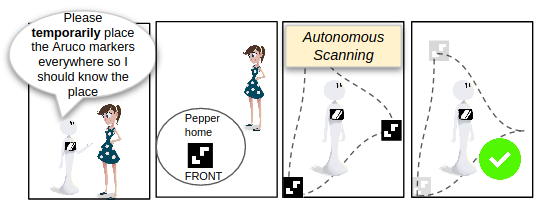
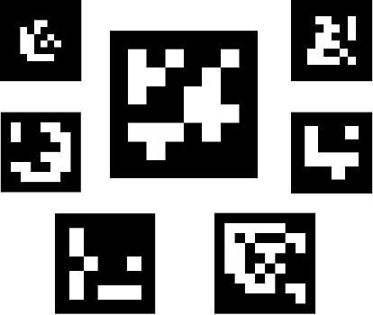
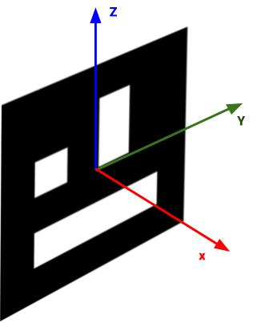
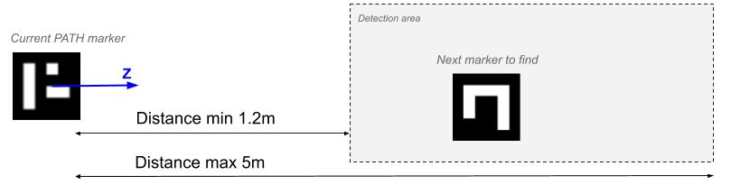
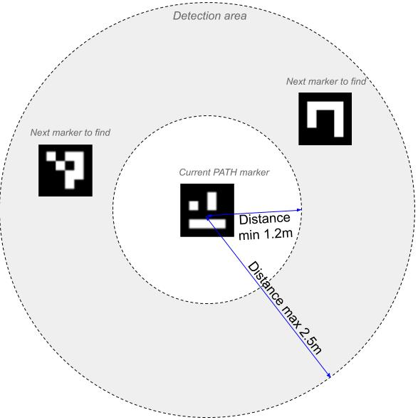
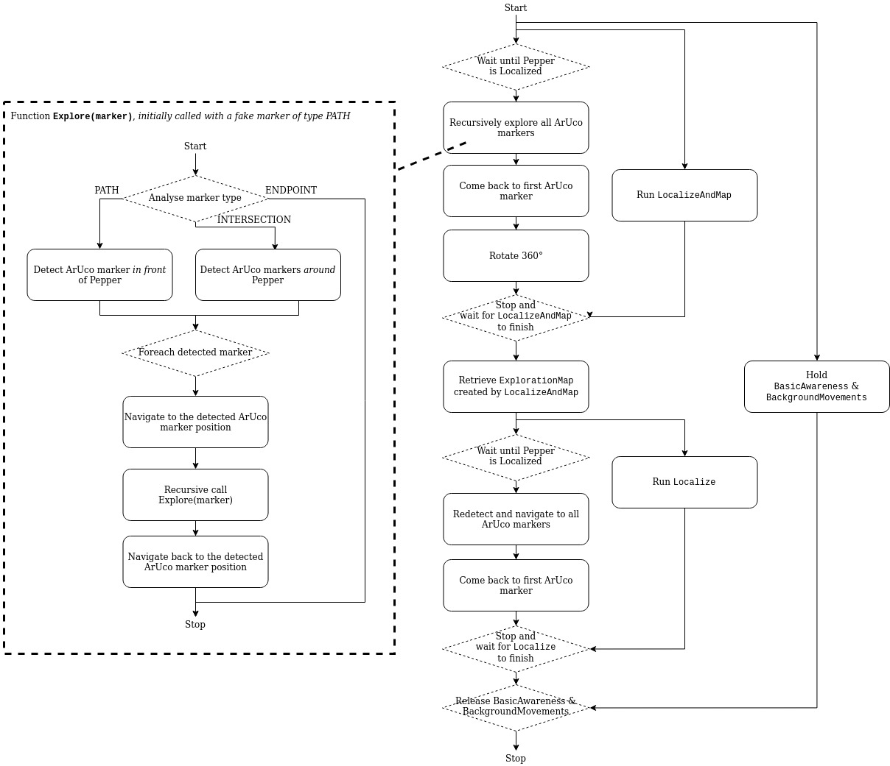

# Pepper Auto-Mapping Library

This library will help you:

* Explore and create a map of Pepper environment by searching for ArUco marker landmarks disseminated in the area on the floor
* Make Pepper patrol the area by navigating between the different positions of the ArUco marker landmarks

<div align="center">
    
</div>

## Table of Content

   * [1. Video demonstration](#1-video-demonstration)
   * [2. ArUco markers](#2-aruco-markers)
   * [3. Getting started](#3-getting-started)
      * [3.1. Running the sample app](#31-running-the-sample-app)
      * [3.2. Print ArUco markers](#32-print-aruco-markers)
   * [4. How to lay out markers for Pepper to map the environment](#4-how-to-lay-out-markers-for-pepper-to-map-the-environment)
      * [4.1. Markers lay out rules](#41-markers-lay-out-rules)
      * [4.2. ArUco marker path concept](#42-aruco-marker-path-concept)
   * [5. Using the library in your project](#5-using-the-library-in-your-project)
      * [5.1. Add the library as a dependency](#51-add-the-library-as-a-dependency)
   * [6. Usage](#6-usage)
      * [6.1. Prerequisite: load OpenCV in our Activity](#61-prerequisite:-load-opencv-in-our-activity)
      * [6.2. `ExploreArucoMarkerPathAndMap` action](#62-explorearucomarkerpathandmap-action)
         * [6.2.1. Goal](#621-goal)
         * [6.2.2. Typical usage](#622-typical-usage)
         * [6.2.3. Example](#623-example)
         * [6.2.4. How it works](#624-how-it-works)
         * [6.2.5. Tuning the `ExploreArucoMarkerPathAndMap` behavior](#625-tuning-the-explorearucomarkerpathandmap-behavior)
            * [6.2.5.1. Marker size](#6251-marker-size)
            * [6.2.5.2. ArUco marker dictionary](#6252-aruco-marker-dictionary)
            * [6.2.5.3. Marker info callback (required)](#6253-marker-info-callback-(required))
            * [6.2.5.4. Endpoint markers](#6254-endpoint-markers)
         * [6.2.6. `ExploreArucoMarkerPathAndMap` status listener](#626-explorearucomarkerpathandmap-status-listener)
         * [6.2.7. ArUco marker explored listener](#627-aruco-marker-explored-listener)
      * [6.3. `ArucoMarkerPath` object](#63-arucomarkerpath-object)
         * [6.3.1. What it is](#631-what-it-is)
         * [6.3.2. How to use it](#632-how-to-use-it)
            * [6.3.2.1. Saving `ArucoMarkerPath` for future use](#6321-saving-arucomarkerpath-for-future-use)
            * [6.3.2.2. Loading `ArucoMarkerPath` from its saved content](#6322-loading-arucomarkerpath-from-its-saved-content)
      * [6.4. Internal storage read & write helpers](#64-internal-storage-read-&-write-helpers)
   * [7. License](#7-license)


## 1. Video demonstration

Please watch the following video on YouTube to see how this library works in practice: https://youtu.be/TV6yXSxwYlk

## 2. ArUco markers

An ArUco marker is a synthetic square marker composed by a wide black border and an inner binary matrix. The black border facilitates its fast detection in the image and the binary codification allows its identification and the application of error detection and correction techniques. The markers can be of different size, 4x4, 5x5 or 6x6.

Some examples of ArUco markers:

<div align="center">
    
</div>

A dictionary of markers is the set of markers that are considered in a specific application.
Each marker has an id. This id is the marker index within the dictionary it belongs to.

The markers have an orientation. In this library, we define the default ArUco axis as follows:

<div align="center">
    
</div>

We chose this coordinate system to be consistent with Pepper QiSDK coordinate system. Beware however as OpenCV uses another coordinate system on material you'll find out there on the internet.

## 3. Getting started


### 3.1. Running the sample app

The project comes complete with a sample project. You can clone the repository, open it in Android Studio, and run this directly onto a Robot.

The sample application will make Pepper explore the space in search for ArUco markers laid out on the floor.

* You will need to have ArUco markers in order to play with the tutorial. See [3.2. Print ArUco markers](#32-print-aruco-markers). By default the sample app use 4 markers, with ids 1, 2, 3 and 4. Print those markers or modify the sample app code if you want to use different markers (file [MainActivity](app/src/main/java/com/softbankrobotics/arucoautomapping/MainActivity.kt) line 414)

* You will need to correctly place ArUco markers on the floor for Pepper to find them during its exploration. See [3. How to lay out markers for Pepper to map the environment](3-how-to-lay-out-markers-for-pepper-to-map-the-environment), and then place Pepper in front of one of them.

Then you can start the sample app and let Pepper explore.


### 3.2. Print ArUco markers

You can find some printable mats (containing markers, as well as extra indications) in the <a href="mats/">"mats"</a> folder, in pdf and svg formats. They come in two sizes:

 * A4 (21 x 29.7cm)
 * A3 (29.7 x 42cm)

Both use 15cm ArUco markers; and their IDs correspond to the ones recognized by the sample app.

In this set, the "PATH" markers are shaped like an arrow, indicating the next direction in which Pepper will look for a marker.

<p align="center">
    
    
    
</p>

You can also generate your own ArUco Markers, for instance with [this website](http://chev.me/arucogen/).
Choose 4x4 ArUco markers, of size 150mm, and pick an ID inferior at 50. You can use the same IDs as those in the sample app, or redefine them.

## 4. How to lay out markers for Pepper to map the environment

When you run the sample app, or the individual SDK actions contained in this library, Pepper will explore the area by searching for ArUco markers around it, navigate to them and recursively search for more markers.

<div align="center">
    
</div>

### 4.1. Markers lay out rules

You need to lay out the markers on the floor of the area prior to launching the sample app. And while doing so you need to follow some rules:

* Markers must be unique

You cannot have the same marker twice.

* Markers must be placed on the floor

Pepper will search for ArUco markers placed on the floor. Other markers (on the wall, ceiling, ...) will be ignored.

* Each marker must have one of the following type: PATH, INTERSECTION or ENDPOINT

You'll set this type programmatically in the code. The type of the marker will guide Pepper in its exploration.

**PATH marker**: During its exploration of the area, when Pepper encounters a PATH marker, it will consider there is another marker to find after this one. It will search for that next marker in the direction of the z axis of the PATH marker. That marker must be between **1.2** and **5** meter away from the current marker.

<p align="center">
    
</p>

**INTERSECTION marker**: During its exploration of the area, when Pepper encounters an INTERSECTION marker, it will consider there are one or several markers to find after this one. It will search for these next markers in all directions. These markers must be between **1.2** and **2.5** meter away from the current marker.

<p align="center">
    
</p>

**ENDPOINT marker**: During its exploration of the area, when Pepper encounters an ENDPOINT marker, it will consider there is no more marker to explore after this one.

* Markers should measure 15 cm

That is the size we use in the sample app. With the individual library actions you can customize the markers size, however from our test a size between 15 and 20 cm works fine. Below 15 cm markers are too small and Pepper will not see them, while over 20cm they are too big and detection is not really improved. If you use a different size, be sure to specify it in the code (with the `withMarkerLength` parameter) in addition to in the markers you print, as Pepper uses that parameter to estimate the markers' distance.

* There should be a root marker and Pepper will be placed in front of it when starting the exploration

The root marker is the first marker Pepper will explore. We call it the HOME. As any other marker, this marker has a type (PATH, INTERSECTION or ENDPOINT); in the default set provided, it's a PATH.


### 4.2. ArUco marker path concept

An ArUco marker path is the complete path represented by all markers layed out in the area. An ArUco marker path is a tree-like structure, with a root node (the HOME marker) and one or more leaves (all the ENDPOINT markers).


## 5. Using the library in your project

### 5.1. Add the library as a dependency

[Follow these instructions](https://jitpack.io/#softbankrobotics-labs/pepper-automapping)

Make sure to replace 'Tag' by the number of the version of the library you want to use, or by 'master-SNAPSHOT' to use the master branch.


## 6. Usage

### 6.1. Prerequisite: load OpenCV in our Activity

In your Activity class, you need to load opencv in the `onCreate` method in order to be able to use the library. To do so, call `OpenCVUtils.loadOpenCV(this)`:

```kotlin

class MyActivity : AppCompatActivity(), RobotLifecycleCallbacks {

    override fun onCreate(savedInstanceState: Bundle?) {
        super.onCreate(savedInstanceState)

        OpenCVUtils.loadOpenCV(this)
        //...
    }
```

### 6.2. `ExploreArucoMarkerPathAndMap` action

#### 6.2.1. Goal

Creates a [`ExplorationMap`](https://developer.softbankrobotics.com/pepper-qisdk/api/motion/reference/explorationmap) of the environment, as well as an `ArucoMarkerPath` by making Pepper recursively explore a path defined by ArUco markers on the floor.


#### 6.2.2. Typical usage

You want Pepper to create an [`ExplorationMap`](https://developer.softbankrobotics.com/pepper-qisdk/api/motion/reference/explorationmap) of the area autonomously without pushing it around. You want to define paths Pepper can use to navigate from one place to another.


#### 6.2.3. Example

```kotlin
try {

    // Create the action
    val explorer = ExploreArucoMarkerPathAndMapBuilder.with(qiContext)
            .withMarkerDictionary(ArucoDictionary.DICT_4X4_100)
            .withMarkerLength(arucoMarkerSize)
            .withMarkerInfoCallback { when (it) {
                1 -> ArucoMarkerInfo(ArucoMarkerType.PATH, 0.0)
                2 -> ArucoMarkerInfo(ArucoMarkerType.INTERSECTION, 0.0)
                3 -> ArucoMarkerInfo(ArucoMarkerType.ENDPOINT, 0.0)
                4 -> ArucoMarkerInfo(ArucoMarkerType.ENDPOINT, 0.0)
                else -> ArucoMarkerInfo(ArucoMarkerType.INVALID, 0.0)
            }}
            .withEndpointMarkers(setOf(3, 4))
            .build()

    // Run it, and get back an ExplorationMap and a marker path you can use with GoTo
    val (explorationMap: ExplorationMap, markerPath: ArucoMarkerPath)
            = explorer.run().getOrThrow()

} catch (e: FailedToGoToMarkerException) {
    Log.i(TAG,"Failed to go to marker ${e.markerId}")
} catch (e: LocalizeAndMapException) {
    Log.i(TAG,"Failed to LocalizeAndMap")
} catch (e: LocalizeException) {
    Log.i(TAG,"Failed to Localize")
} catch (e: EndpointsNotReachedException) {
    Log.i(TAG,"Failed to reach endpoint markers")
} catch (e: Throwable) {
    Log.i(TAG, e.toString())
}
```


#### 6.2.4. How it works

The `ExploreArucoMarkerPathAndMap` action is a complex behavior. The actions it executes are summarized on the following flowchart.



The content of the `Explore(marker)` recursive function has also been added to the flowchart as it is an important part of the behavior.


#### 6.2.5. Tuning the `ExploreArucoMarkerPathAndMap` behavior

##### 6.2.5.1. Marker size

```Kotlin
fun ExploreArucoMarkerPathAndMapBuilder.withMarkerLength(markerLength: Double): ExploreArucoMarkerPathAndMapBuilder
```

Set the size of the side of the ArUco markers. In meters.
By default, `ExploreArucoMarkerPathAndMap` uses 0.15 meters.


##### 6.2.5.2. ArUco marker dictionary

```Kotlin
fun ExploreArucoMarkerPathAndMapBuilder.withDictionary(dictionary: ArucoDictionary): ExploreArucoMarkerPathAndMapBuilder
```

A dictionary of markers is the set of markers that are considered in a specific application.
The main properties of a dictionary are the dictionary size and the marker size.

* The dictionary size is the number of markers that compose the dictionary.
* The marker size is the size of those markers (the number of bits).

By default, `ExploreArucoMarkerPathAndMap` uses `ArucoDictionary.DICT_4X4_50`.


##### 6.2.5.3. Marker info callback (required)


```Kotlin
fun ExploreArucoMarkerPathAndMapBuilder.withMarkerInfoCallback(getArucoMarkerInfoCallback: (Int)-> ArucoMarkerInfo): ExploreArucoMarkerPathAndMapBuilder
```

For each marker you can specify the marker type and optional rotation for the marker direction (given by its Z axis). You need to give as parameter a function that takes a marker id and returns an `ArucoMarkerInfo` associated to it.

```Kotlin
data class ArucoMarkerInfo(
  val type: ArucoMarkerType,
  val directionRotationAngle: Double = 0.0
)
```

`ArucoMarkerInfo.type`: Markers have a type associated with them, which indicate to Pepper how to process the current marker and how/if it should search for the next marker in the marker path.
Marker type can be one of:

* `ArucoMarkerType.PATH`: Tell Pepper to search for the next marker in the direction indicated by the marker Z axis
* `ArucoMarkerType.INTERSECTION`: Tell Pepper to search for the next markers in all directions around current marker
* `ArucoMarkerType.ENDPOINT`: Tell Pepper this marker is an endpoint, and there are no more marker after it
* `ArucoMarkerType.INVALID`: Tell Pepper to ignore that marker

`ArucoMarkerInfo.directionRotationAngle` (`PATH` type only): In case of a `PATH` marker, Pepper will explore for a new marker in the direction indicated by the current marker. If you want to modify the marker direction, set the `directionRotationAngle` to some value different than 0. For instance, use 45.0 if you want to change the direction by an angle of 45 degrees.

##### 6.2.5.4. Endpoint markers

```Kotlin
fun ExploreArucoMarkerPathAndMapBuilder.withEndpointMarkers(endpointMarkers: Set<Int>): ExploreArucoMarkerPathAndMapBuilder
```

Specify all endpoints markers that should be discovered by the exploration algorithm. If any of the endpoints markers you specified are not found by Pepper at the end of the exploration, then the action will raise an `EndpointsNotReachedException` exception.

#### 6.2.6. `ExploreArucoMarkerPathAndMap` status listener


```Kotlin
interface OnStatusChangedListener {
    fun onStatusChanged(status: Status)
}

fun ExploreArucoMarkerPathAndMap.addOnStatusChangedListener(listener: OnStatusChangedListener)
fun ExploreArucoMarkerPathAndMap.removeOnStatusChangedListener(listener: OnStatusChangedListener)
fun ExploreArucoMarkerPathAndMap.removeAllOnStatusChangedListeners()
```

Observe the `ExploreArucoMarkerPathAndMap` state while the action is running. Use these functions to set status change listener. The listener has to be a subclass of `OnStatusChangedListener` and overload the `onStatusChanged` function.

It will be called with the following status:

* `LOCALIZING_AND_MAPPING`: Pepper has started the [`LocalizeAndMap`](https://developer.softbankrobotics.com/pepper-qisdk/api/motion/reference/localizeandmap) action and is localizing.
* `EXPLORING_PATH`: Pepper is recursively searching for ArUco markers.
* `RETRIEVING_MAP`: Pepper is retrieving the map created by [`LocalizeAndMap`](https://developer.softbankrobotics.com/pepper-qisdk/api/motion/reference/localizeandmap).
* `LOCALIZING`: Pepper has started the [`Localize`](https://developer.softbankrobotics.com/pepper-qisdk/api/motion/reference/localize) action and is localizing.
* `REVISITING_PATH`: Pepper is re-detecting and navigating to all ArUco markers.

#### 6.2.7. ArUco marker explored listener

```Kotlin
interface OnArucoMarkerExploredListener {
    fun onArucoMarkerExplored(marker: ArucoMarker)
}

fun ExploreArucoMarkerPathAndMap.addOnArucoMarkerExploredListener(listener: ExploreArucoMarkerPath.OnArucoMarkerExploredListener)
fun ExploreArucoMarkerPathAndMap.removeOnArucoMarkerExploredListener(listener: ExploreArucoMarkerPath.OnArucoMarkerExploredListener)
fun ExploreArucoMarkerPathAndMap.removeAllOnArucoMarkerExploredListeners()
```

Observe markers exploration by setting the marker explored listener. The listener will be called whenever Pepper has explored an ArUco marker (it has detected it and navigated to its position). The listener has to be a subclass of `OnArucoMarkerExploredListener` and overload the `onArucoMarkerExplored` function.


### 6.3. `ArucoMarkerPath` object

#### 6.3.1. What it is

An `ArucoMarkerPath` contains all the information about the ArUco markers that were detected and explored during the Pepper exploration of the area. It especially stores the path that Pepper took to go from one ArUco to the other.

#### 6.3.2. How to use it

`ArucoMarkerPath` contain the following field and functions:

* `val ArucoMarkerPath.markers: Set<ArucoMarker>`:  A set containing all the `ArucoMarker`s objects that were explored.

* `val ArucoMarkerPath.markerIds: Set<Int>`: A set containing all the ids of the `ArucoMarker`s objects that were explored.

* `val ArucoMarkerPath.home: ArucoMarker?`: The id of the first `ArucoMarker` that was explored.

* `fun ArucoMarkerPath.getPath(from: Frame, toArucoMarkerId: Int): Future<List<ArucoMarker>>`: Return the list of `ArucoMarker` that Pepper has to go through to reach the ArUco marker with id `toArucoMarkerId` from the position `from`. This is especially useful when you want to make Pepper navigate from some position to another position represented by an ArUco marker. You can use all the intermediate `ArucoMarker.frame` positions as intermediate targets for a `GoTo` action.

* `fun ArucoMarkerPath.getPath(fromArucoMarkerId: Int, toArucoMarkerId: Int): Future<List<ArucoMarker>>`: Return the list of `ArucoMarker` that Pepper has to go through to reach the ArUco marker with id `toArucoMarkerId` from the ArUco marker with id `fromArucoMarkerId`. This is especially useful when you want to make Pepper navigate from some position represented by an ArUco Marker to another position represented by an ArUco marker. You can use all the intermediate `ArucoMarker.frame` positions as intermediate targets for a `GoTo` action.


##### 6.3.2.1. Saving `ArucoMarkerPath` for future use

```Kotlin
fun ArucoMarkerPath.serialize(qiContext: QiContext): String
```

You can serialize an `ArucoMarkerPath` using the `serialize` function. It will return a `String` that you can save to a file and store persistently.

**NB:** Pepper MUST be localized (use a [`LocalizeAndMap`](https://developer.softbankrobotics.com/pepper-qisdk/api/motion/reference/localizeandmap) or a [`Localize`](https://developer.softbankrobotics.com/pepper-qisdk/api/motion/reference/localize) action) before you can call the `serialize` function.


##### 6.3.2.2. Loading `ArucoMarkerPath` from its saved content

To load an `ArucoMarkerPath` from its serialized content, you can use an `ArucoMarkerPathBuilder` object.

```Kotlin
val arucoPathData: String = ...
val arucoMarkerPath = ArucoMarkerPathBuilder.with(qiContext)
    .withPathString(arucoPathData)
    .build()
```

**NB:** Pepper MUST be localized (use a [`LocalizeAndMap`](https://developer.softbankrobotics.com/pepper-qisdk/api/motion/reference/localizeandmap) or a [`Localize`](https://developer.softbankrobotics.com/pepper-qisdk/api/motion/reference/localize) action) before you can load an `ArucoMarkerPath` from its content.

### 6.4. Internal storage read & write helpers

This library provides several helper functions to ease writing and reading `String` objects to internal storage. They can be used to store the serialized `ArucoMarkerPath` and [`ExplorationMap`](https://developer.softbankrobotics.com/pepper-qisdk/api/motion/reference/explorationmap) objects.

```Kotlin
fun Context.writeToInternalStorage(string: String, outputFilename: String,
                                   appendIfExists: Boolean = false)
```

Write a `String` to internal storage. If parameter `appendIfExists` is false, then the created file will be truncated.

```Kotlin
fun Context.readFromInternalStorage(inputFilename: String): String
```

Read a file from internal storage and return its content as a `String`.

```Kotlin
fun Context.writeToInternalStorage(buffer: StreamableBuffer, outputFilename: String,
                                   appendIfExists: Boolean = false)
```

Write a `StreamableBuffer` to internal storage. If parameter `appendIfExists` is false, then the created file will be truncated.

```Kotlin
fun Context.readStreamableBufferFromInternalStorage(inputFilename: String): StreamableBuffer
```

Read a file from internal storage and return its content as a `StreamableBuffer`.


## 7. License

This project is licensed under the BSD 3-Clause "New" or "Revised" License- see the [COPYING](COPYING.md) file for details
